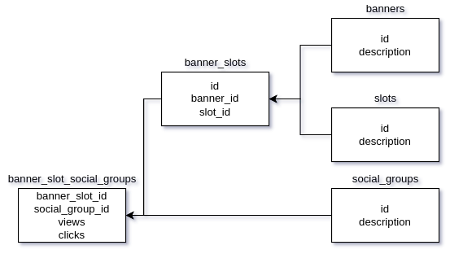

# Banner Rotation

[](https://goreportcard.com/report/github.com/arthurshafikov/banner-rotation)


This is my pet-project. It is used for choosing one the most efficient banner for given slot and social demographical group of user. 

So let's say we have a slot in our website with some banners that can be shown in that slot, and we want to maximize the chance that visitor will click on our banner, this microservice will return the needed result based on user social demographical group (like "male 20-25") and what the slot is.
For this I used the Multihanded Bandit algorythm.

This project has as unit, as an integration tests.

Also all statistics about clicks and views are sending to Kafka. So we can take this statistic and handle it somewhere else (like in Graphana for example) to see which banners are the most profitable and which are not.

# Database

The database structure is looking like this



# Commands

## Docker-compose

Run the application
```
make up
```

Down the application
```
make down
```

---
## Database

Enter the database (postgresql)
```
make enterdb
```

---
## Tests

Run unit tests
```
make test
```

Run integration tests
```
make integration-tests
```

Down all the integration test containers
```
make reset-integration-tests
```

---
## Linters

Run linters (you have to have golangci-lint installed on your PC)
```
make lint
```

Run integration tests
```
make integration-tests
```

Down all the integration test containers
```
make reset-integration-tests
```
